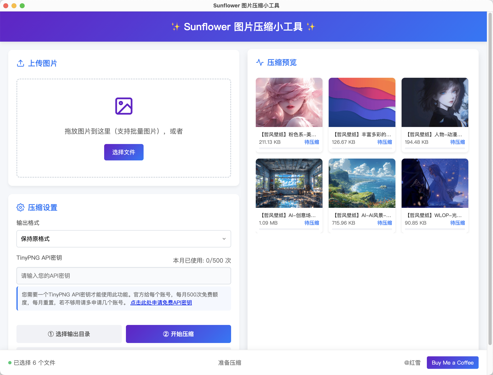

# sunflower 图片压缩小工具

基于TinyPNG API开发的图片质量压缩工具，支持多种图片格式的智能压缩，当前最佳的图片压缩小工具！友好且完全开源免费！

## 功能特点

- 支持JPG、PNG、WebP等多种图片格式压缩，支持批量图片处理；对比官网，支持 **超过5M** 的图片压缩！操作比官网网页版本更方便！
- 使用TinyPNG API进行智能无损压缩，会自动压缩到最佳质量，并且不损失显示效果
- 可自定义输出格式
- 简洁直观的用户界面，mini级别的应用体积，适合在电脑上使用的最佳图片压缩工具！
- 小技巧：因为tiny会自动压缩到最佳质量，如果你对压缩后的质量不满意，可以重复把**压缩后**的图片再上传压缩一次，直到满意为止。

## 页面预览


## 安装指南

1. 确保已安装Node.js (建议版本14+)和npm
2. 克隆本项目
3. 运行 `npm install` 安装依赖
4. **重要**: 创建 `app-config.json` 文件（见下方说明）
5. 运行 `npm start` 启动应用

## 配置文件设置

在首次运行前，您需要在项目根目录创建 `app-config.json` 文件，内容如下：

```json
{
  "apiKey": "",
  "usageCount": 0,
  "lastResetMonth": 0,
  "inputDirectory": "",
  "outputDirectory": "",
  "lastOpenedDirectory": ""
}
```

**说明**：
下述内容无需手动填写，获取APIKEY后，在页面填写，会自动完成更新。
- `apiKey`: 您的TinyPNG API密钥（无需在文件中填写）
- `usageCount`: 当月已使用次数（自动更新）
- `lastResetMonth`: 上次重置计数的月份（自动更新）
- `inputDirectory`: 上次选择的输入目录(自动维护)
- `outputDirectory`: 上次选择的输出目录(自动维护)
- `lastOpenedDirectory`: 上次打开的目录(自动维护)

> 注意：如果不创建此文件，应用会在首次运行时自动创建默认配置，但建议手动创建以避免权限问题。

## 使用说明

1. 上传图片：拖放图片到指定区域或点击选择文件
2. 设置压缩选项：
   - 选择输出格式（保持原格式/JPG/PNG/WebP）
   - 输入TinyPNG API密钥
3. 点击"开始压缩"按钮
4. 压缩完成后可查看预览并保存结果

## API密钥获取

1. 访问[TinyPNG开发者页面](https://tinypng.com/developers)
2. 注册账号并申请API密钥
3. 每月有500次免费压缩额度

## 注意事项

- 请妥善保管您的API密钥，如果丢失登录TinyPNG官网账号可以查看。
- 压缩大文件可能需要较长时间，比如10M以上的图片，这个跟您的网络快慢也有一定关系。
- 免费账户每月有500次压缩限制，大部分人用不了这么多，如果必须要超过限制，建议多注册几个账号，这很容易做到。

## 常见问题

Q: 为什么需要API密钥？
A: 本工具使用TinyPNG的API服务进行图片压缩，需要有效的API密钥才能工作。而且tinyPNG是目前最好的压缩工具，压缩效果最佳，轻便灵敏，但是官网只能支持5M以内图片压缩，所以创建这个工具，可以支持大于5M以上的图片进行压缩。

Q: 压缩后的图片质量会下降吗？
A: TinyPNG使用智能算法，可以在几乎不损失视觉质量的情况下大幅减小文件体积。是超级棒的压缩工具。

Q: 如果没有创建app-config.json文件会怎样？
A: 程序会尝试自动创建，但在某些系统环境下可能因权限问题导致创建失败，建议手动创建。

## 贡献指南

欢迎提交问题报告和功能建议。如果您想贡献代码，请遵循以下步骤：

1. Fork 本仓库
2. 创建您的特性分支 (`git checkout -b feature/amazing-feature`)
3. 提交您的更改 (`git commit -m 'Add some amazing feature'`)
4. 推送到分支 (`git push origin feature/amazing-feature`)
5. 打开一个 Pull Request

## 开源许可

本项目采用 MIT 许可证 - 详情请参阅 [LICENSE](LICENSE) 文件

## 联系方式

如有问题或建议，请通过 GitHub Issues 与我们联系。

---

© 2025 红雪-3280766842@qq.com
